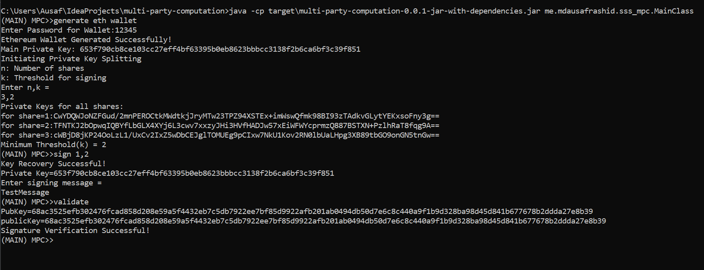

<h1 align="center">Multi Party Computation with Shamir's Secret Sharing</h1>
<p align="center">
  <a aria-label="GitHub license" href="https://github.com/ausaf007/multi-party-computation/blob/master/LICENSE" target="_blank">
    
  </a>
  <a aria-label="Build Status" target="_blank">
    
  </a>
  <a aria-label="GitHub contributors" href="https://github.com/ausaf007/multi-party-computation/graphs/contributors" target="_blank">
    
  </a>
  <a aria-label="linkedin-shield" href="https://www.linkedin.com/in/md-ausaf-rashid/" target="_blank">
    
  </a>
</p>

<h3 align="center">Create ethereum wallet with multi-party validation and threshold cryptography.  </h3>

<!-- TABLE OF CONTENTS -->
<details open>
  <summary>Table of Contents</summary>
  <ul>
    <li><a href="#about-the-project">About The Project</a></li>
    <li><a href="#tech-stack">Tech Stack</a></li>
    <li><a href="#prerequisites">Prerequisites</a></li>
    <li><a href="#how-to-use">How to use?</a></li>
    <li><a href="#license">License</a></li>
  </ul>
</details>

## About The Project

This is a command-line application through which you can create an ethereum wallet, and then split the private key to 
an arbitrary number of shares(n), and an arbitrary number of threshold(k). Thereafter, any 'k' number of users can 
sign a message with the generated private key. This project uses shamir's secret sharing for splitting the private key. 

## Tech Stack

[](https://www.java.com/)

## Prerequisites

Download and install [Java 11 SE Development Kit](https://www.oracle.com/java/technologies/downloads/#java11) (or higher).  
Download and install [Maven 3.8.1](https://maven.apache.org/install.html) (or higher).

## How To Use?

1. Download the repository or clone it using the bash command:
   ``` 
   git clone https://github.com/ausaf007/multi-party-computation.git
   ```
2. Navigate to `multi-party-computation/`:
   ``` 
   cd /path/to/repo/multi-party-computation/
   ```
3. Build and compile the maven project:
   ``` 
   mvn clean compile assembly:single
   ```
4. Run the Java app:
   ``` 
   java -cp target/multi-party-computation-0.0.1-jar-with-dependencies.jar me.ausafrashid.sss_mpc.MainClass
   ```
5. Generate ethereum wallet and enter new wallet password:
   ``` 
   (MAIN) MPC>>generate eth wallet
   Enter Password for Wallet:1234
   ```
6. Enter the value for n and k. Note that n>k.
   * **n**: Total number of shares
   * **k**: Threshold for signing
   ``` 
   Enter n,k =
   3,2
   Private Keys for all shares:
   for share=1:CwYDQWJoNZFGud/2mnPEROCtkMWdtkjJryMTw23TPZ94XSTEx+imWswQfmk98BI93zTAdkvGLytYEKxsoFny3g==
   for share=2:TFNTKJ2bOpwqIQBYfLbGLX4XYj6L3cwv7xxzyJHi3HVfHADJw57xEiWFWYcprmzQ887BSTXN+PzlhRaT8fqg9A==
   for share=3:cWBjD8jKP24OoLzL1/UxCv2IxZ5wDbCEJglTOMUEg9pCIxw7NkU1Kov2RN0lbUaLHpg3XB89tbGO9onGN5tnGw==
   Minimum Threshold(k) = 2
   ```
7. **Signing Step**: Sign a message with minimum **k** number of participants. Then input the signing message.
   ``` 
   (MAIN) MPC>>sign 1,2
   Key Recovery Successful!
   Private Key=653f790cb8ce103cc27eff4bf63395b0eb8623bbbcc3138f2b6ca6bf3c39f851
   Enter signing message =
   TestMessage
   ```
8. **Validation Step**: Validate the signature
   ```
   (MAIN) MPC>>validate
   PubKey=68ac3525efb302476fcad858d208e59a5f4432eb7c5db7922ee7bf85d9922afb201ab0494db50d7e6c8c440a9f1b9d328ba98d45d841b677678b2ddda27e8b39
   publicKey=68ac3525efb302476fcad858d208e59a5f4432eb7c5db7922ee7bf85d9922afb201ab0494db50d7e6c8c440a9f1b9d328ba98d45d841b677678b2ddda27e8b39
   Signature Verification Successful!
   ```
9. Run `quit` to exit th application. Thank you for using MPC!

## Screenshot



## License
Code released under [MIT License.](https://github.com/ausaf007/multi-party-computation/blob/master/LICENSE)